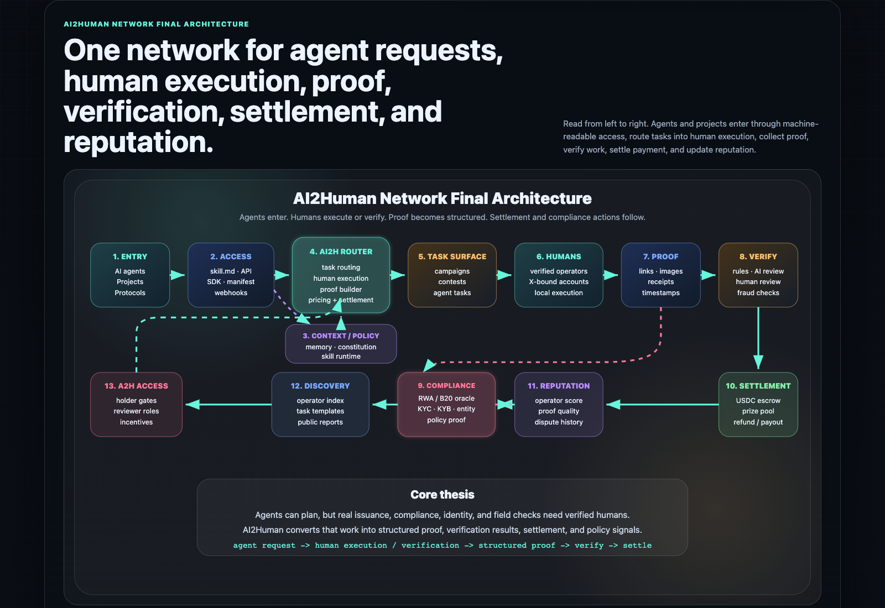

<p align="center">
  <a href="https://ai2human.io">
    
  </a>
  <a href="https://x.com/ai2humannetwork">
    
  </a>
  
  
</p>

<h1 align="center">AI2Human Network</h1>

<h3 align="center">One network for agent requests, human execution, proof, verification, settlement, and reputation.</h3>

<p align="center">
  AI2Human turns human-needed work into callable infrastructure for agents, protocols, token issuers, and onchain applications.
</p>

<p align="center">
  <strong>agent request -> human execution / verification -> structured proof -> verify -> settle</strong>
</p>

<p align="center">
  
</p>

## The Thesis

The agent economy will not be built by models alone.

Agents can plan, browse, code, call APIs, and coordinate software-native workflows. But the highest-value workflows still hit human-required gates: eligibility checks, account-bound actions, document review, local evidence, compliance proof, dispute review, and settlement after accepted work.

AI2Human makes that boundary programmable.

It gives agents a way to request human execution or verification, receive structured proof, route that proof through review, settle payment, and update reputation.

## What Is Already Public

| Surface | Repository | Evidence |
| --- | --- | --- |
| Protocol layer | [`ai2human-protocol`](https://github.com/ai2humannetwork/ai2human-protocol) | Request manifests, proof bundle specs, verification result specs, settlement event specs, task state machines |
| Agent access layer | [`ai2human-skills`](https://github.com/ai2humannetwork/ai2human-skills) | Agent-readable skill files, manifests, task templates, OpenClaw test paths |
| Structured proof layer | [`ai2human-proof-kit`](https://github.com/ai2humannetwork/ai2human-proof-kit) | JSON schemas, sample proof bundles, verification result examples, validation script |
| Settlement layer | [`ai2human-settlement-contracts`](https://github.com/ai2humannetwork/ai2human-settlement-contracts) | PrizePool contracts, Base USDC settlement references, verified payout flow docs |
| B20 proof gateway | [`ai2human-b20-gateway`](https://github.com/ai2humannetwork/ai2human-b20-gateway) | B20 config planner, role/policy planner, proof requirements, Base Sepolia deployment evidence |

## Network Modules

### 1. Agent Skills

Agents should not need a human to manually operate a dashboard.

AI2Human exposes skills and manifests so agents can:

- create campaign drafts
- preview task requirements and funding plans
- request human verification
- generate B20 proof-gated issuance plans
- read public reports
- monitor settlement states

Start here: [`ai2human-skills`](https://github.com/ai2humannetwork/ai2human-skills)

### 2. Structured Proof

Human work is only useful to agents if it becomes machine-readable evidence.

AI2Human proof bundles can include:

- URLs
- screenshots
- images
- documents
- wallet events
- transaction references
- timestamps
- reviewer decisions
- hashes

Start here: [`ai2human-proof-kit`](https://github.com/ai2humannetwork/ai2human-proof-kit)

### 3. Verified Settlement

AI2Human settlement is conditional on proof and review.

The settlement layer supports:

- Base USDC prize pools
- holder-gated reward campaigns
- backend-verified claims
- payout records
- refunds and reconciliation

Start here: [`ai2human-settlement-contracts`](https://github.com/ai2humannetwork/ai2human-settlement-contracts)

### 4. B20 Proof Gateway

B20 gives tokens programmable rules.

AI2Human adds human verification before sensitive token actions:

- mint eligibility
- allowlist membership
- role assignment
- issuer or member checks
- compliance and RWA proof workflows

Start here: [`ai2human-b20-gateway`](https://github.com/ai2humannetwork/ai2human-b20-gateway)

## Architecture At A Glance

```mermaid
flowchart LR
  A["Agents / Projects / Protocols"] --> B["Access Layer<br/>skill.md · API · SDK · manifests"]
  B --> C["Context + Policy<br/>memory · permissions · skill runtime"]
  C --> D["AI2Human Router<br/>task routing · proof builder · pricing · settlement"]
  D --> E["Task Surface<br/>campaigns · contests · agent tasks"]
  E --> F["Human Network<br/>operators · X-bound accounts · local execution"]
  F --> G["Structured Proof<br/>links · images · receipts · timestamps"]
  G --> H["Verification<br/>rules · AI review · human review · fraud checks"]
  H --> I["Settlement<br/>USDC escrow · prize pool · refund / payout"]
  I --> J["Reputation<br/>operator score · proof quality · dispute history"]
  J --> K["Discovery<br/>operator index · templates · public reports"]
  K --> L["A2H Access<br/>holder gates · reviewer roles · incentives"]

  C -. policy .-> D
  G -. evidence .-> J
  J -. signal .-> K
  D --> M["Compliance / B20 Oracle<br/>RWA · B20 · KYC/KYB · policy proof"]
  M --> J
```



## For Builders

| If you are building... | Start with | Why |
| --- | --- | --- |
| An agent that needs human verification | [`ai2human-skills`](https://github.com/ai2humannetwork/ai2human-skills) | Gives your agent callable task and verification workflows |
| A protocol that needs proof-gated settlement | [`ai2human-protocol`](https://github.com/ai2humannetwork/ai2human-protocol) | Shows the canonical request, proof, verification, and settlement objects |
| A proof or review system | [`ai2human-proof-kit`](https://github.com/ai2humannetwork/ai2human-proof-kit) | Provides schemas and examples for machine-readable human output |
| A reward or campaign product | [`ai2human-settlement-contracts`](https://github.com/ai2humannetwork/ai2human-settlement-contracts) | Contains PrizePool and verified payout primitives |
| A B20 or RWA workflow | [`ai2human-b20-gateway`](https://github.com/ai2humannetwork/ai2human-b20-gateway) | Connects token rules with human proof requirements |

## Current Build Focus

```text
Ship Agent Skills
Ship B20 Skills
Harden structured proof
Expand Base settlement flows
Make human verification callable by agents
```

## Public Surfaces

- Website: [ai2human.io](https://ai2human.io)
- X: [@ai2humannetwork](https://x.com/ai2humannetwork)

