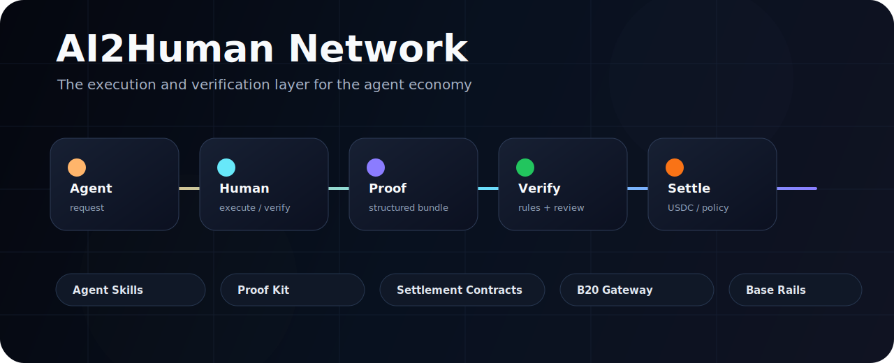
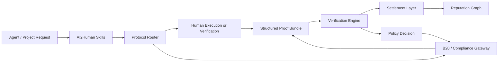

<p align="center">
  
</p>

<p align="center">
  <a href="https://ai2human.work"></a>
  <a href="https://x.com/ai2humannetwork"></a>
  
  
</p>

<h3 align="center">Agent requests. Human proof. Verified settlement.</h3>

<p align="center">
AI2Human Network turns human-needed steps into callable infrastructure for agents, protocols, token issuers, and onchain applications.
</p>

---

## What Breaks

Agents are getting better at planning, browsing, coding, trading, and calling APIs.

But many workflows still fail at the boundary where software needs a verified human step:

- account-bound actions
- document or entity review
- eligibility checks
- local or off-platform evidence
- campaign participation verification
- token access decisions
- dispute and proof review
- settlement after accepted work

AI2Human makes that boundary programmable.

```text
agent request -> human execution / verification -> structured proof -> verify -> settle
```

## The Network Stack

| Layer | Public Module | What It Does |
| --- | --- | --- |
| **Protocol** | [`ai2human-protocol`](https://github.com/ai2humannetwork/ai2human-protocol) | Defines request manifests, proof bundles, verification results, settlement events, and task state machines. |
| **Agent Access** | [`ai2human-skills`](https://github.com/ai2humannetwork/ai2human-skills) | Exposes AI2Human as agent-readable skills, manifests, task templates, and test paths. |
| **Proof** | [`ai2human-proof-kit`](https://github.com/ai2humannetwork/ai2human-proof-kit) | Provides structured proof schemas, sample bundles, reviewer outputs, and validation utilities. |
| **Settlement** | [`ai2human-settlement-contracts`](https://github.com/ai2humannetwork/ai2human-settlement-contracts) | Handles Base USDC prize pools, verified reward settlement, claims, refunds, and payout records. |
| **B20 Gateway** | [`ai2human-b20-gateway`](https://github.com/ai2humannetwork/ai2human-b20-gateway) | Connects Base B20 token rules with AI2Human proof-gated eligibility, roles, policies, and issuance planning. |

## Architecture



## What Is Live In The Open

| Surface | Link | Status |
| --- | --- | --- |
| Network specs | [`ai2human-protocol`](https://github.com/ai2humannetwork/ai2human-protocol) | Public seed |
| Agent skills | [`ai2human-skills`](https://github.com/ai2humannetwork/ai2human-skills) | Public seed |
| Proof schemas | [`ai2human-proof-kit`](https://github.com/ai2humannetwork/ai2human-proof-kit) | Public seed with validator |
| Settlement contracts | [`ai2human-settlement-contracts`](https://github.com/ai2humannetwork/ai2human-settlement-contracts) | Public seed with PrizePool code |
| B20 gateway | [`ai2human-b20-gateway`](https://github.com/ai2humannetwork/ai2human-b20-gateway) | Public seed with Base Sepolia evidence |
| Product app | [ai2human.work](https://ai2human.work) | Live product surface |

## Developer Entry Points

**For agents**

Start with [`ai2human-skills`](https://github.com/ai2humannetwork/ai2human-skills). It contains skill files, manifests, task templates, and OpenClaw-compatible test paths for creating and previewing AI2Human workflows.

**For protocol builders**

Start with [`ai2human-protocol`](https://github.com/ai2humannetwork/ai2human-protocol). It defines the canonical objects behind the network: requests, proof, verification, settlement, and reputation events.

**For token issuers**

Start with [`ai2human-b20-gateway`](https://github.com/ai2humannetwork/ai2human-b20-gateway). It shows how B20 token configuration, roles, policies, and human proof requirements can be planned together.

**For reviewers and verification systems**

Start with [`ai2human-proof-kit`](https://github.com/ai2humannetwork/ai2human-proof-kit). It contains the schemas and examples for turning human output into machine-readable evidence.

## Why This Matters

The agent economy will not be built by models alone.

It needs:

- execution networks
- human verification
- structured proof
- policy-aware token flows
- settlement rails
- reputation that compounds from completed work

AI2Human is building that layer.

## Current Build Focus

```text
Ship Agent Skills
Ship B20 Skills
Harden structured proof
Expand Base settlement flows
Make human verification callable by agents
```

## Public Surfaces

- Website: [ai2human.work](https://ai2human.work)
- X: [@ai2humannetwork](https://x.com/ai2humannetwork)

